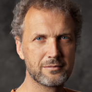

---
# Feel free to add content and custom Front Matter to this file.
# To modify the layout, see https://jekyllrb.com/docs/themes/#overriding-theme-defaults

permalink: /
title: Home
workshop_title: Towards Reliable and Deployable Learning-based Robotic Systems
layout: home
conference_title: Conference on Robot Learning 2023, Atlanta, USA
workshop_date: Monday, Nov 6th, 2023
workshop_length: Full-day workshop
---

The field of robot learning has made substantial progress in endowing robots with greater capability. Despite these advancements, the large-scale real-world adoption of learning-based robotic systems remains limited. This workshop aims to dissect this phenomenon, identifying best practices and novel approaches that could lead to a paradigm shift in how we conceive and build reliable learning-based robotic systems. 

We intend to guide our conversations with the following topics:
1. What are the key challenges in deploying learning-based systems in real-world scenarios?
2. What are the ingredients to ensure the reliability and robustness of learning-based robotic systems? And how do the deployed classical robotic systems handle such challenges?
3. How should we design learning algorithms that allow for seamless integration with robotic systems to handle edge cases and unforeseen scenarios in the real world?
4. What role does simulation play in the testing and verification of these systems?
5. What are the key success stories and lessons learned from existing deployments of classical robotic systems?

Due to the interdisciplinary nature of this workshop, we encourage participants not only from the robot learning community, but equally importantly those from classical robotics and control systems, as well as industry practitioners with first-hand experience deploying such systems.

&nbsp;
&nbsp;

### Speakers

<article class="gallery">
  <figure>
  
  <figcaption>Xiaolong Wang (UCSD)</figcaption>
  </figure>

  <figure>
   
  <figcaption>Stefan Schaal (Intrinsic)</figcaption>
  </figure>

  <figure>
  
  <figcaption>Sergey Levine (Berkeley)</figcaption>
  </figure>

  <figure>
  
  <figcaption>Scott Kuindersma (Boston Dynamics)</figcaption>
  </figure>

  <figure>
  
  <figcaption>Russ Tedrake (MIT, TRI)</figcaption>
  </figure>

  <figure>
  
  <figcaption>Nicolas Heess (Deepmind)</figcaption>
  </figure>

  <figure>
  
  <figcaption>Emo Todorov (UW)</figcaption>
  </figure>

  <figure>
  
  <figcaption>Dieter Fox (UW, Nvidia)</figcaption>
  </figure>

  <figure>
  
  <figcaption>Chelsea Finn (Stanford)</figcaption>
  </figure>

</article>
